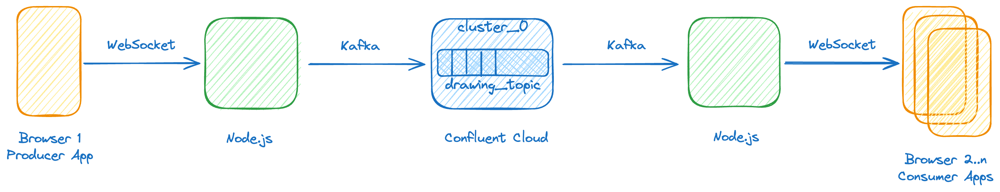
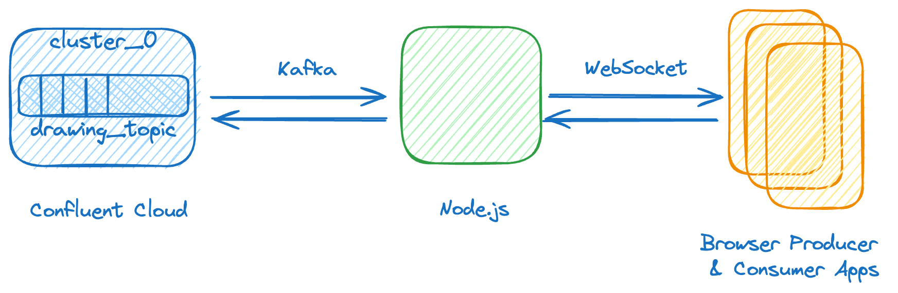

# Lessons Learned from Building a Kafka App From Scratch Using HTML5, WebSocket, NodeJS with ChatGPT-4o

> _This repo contains the source code for my [blog post](https://medium.com/@peter.moskovits/cc9b45885f99) on medium. Here's the intro and outro sections of the blog post. You find the rest of the post under Step 01 - Step 11._

Many moons ago, my job was to build HTML5 apps showcasing the power of the newly ratified WebSocket standard. A common challenge with data streaming demos and tutorials is sourcing the data. The data should be plentiful (temperature data from my balcony is slow-changing and thus quite boring) and verifiable (random data cannot be visualized). Using human-generated and relatable data is often a good solution. One of the apps I built in the past to address this issue was a multi-user drawing app that mirrored the interactions of a user on another user’s screen.

Ever since I started working with Apache Kafka, I wanted to build this simple demo app with a Kafka back-end. I had been putting it off because I always thought it would take several days, and I never felt I had the time.

## About the Demo App
My high-level goal is to connect Kafka to Node.js and have Node.js talk to the browser via WebSocket. I want to have two separate web apps: a producer app that we use for drawing and a consumer app that mirrors the drawing from another device. For the Kafka back-end, I wanted to use Confluent Cloud, not only because I work for Confluent but also because a simple, polished cloud environment is an easy choice for an experiment like this.

I finally decided to give it a try, but with a twist: I wanted to see how helpful the recently released ChatGPT-4o would be as an assistant. This post gives you a glimpse into my interaction and journey with ChatGPT, the errors we ran into, and how we resolved them (got to love how I’m already treating this model as a person).

As for how my friend performed: I was genuinely impressed every step of the way and ended up with a simple but functioning app on the first try! I was in the driver’s seat and broke down the problem into bite-sized tasks and testable steps. ChatGPT made two errors that it easily corrected when I pointed them out. As part of this exercise, I’m sharing all the prompts, responses, and code snippets verbatim, thinking that it will also serve as a glimpse or a snapshot into our incredibly fast-changing world.

I’m thoroughly impressed and concerned at the same time, hoping that this brave new world of ours will turn out not to be a disastrous one.

## Architecture Overview

A Kafka cluster, running in Confluent Cloud, is at the center of our app. Messages are published to and consumed from the drawing_topic. The heavy lifting of the Kafka interaction is done by the producer (left) and consumer (right) Node.js apps. Lastly, the data that needs to be published (drawing coordinates and some drawing-related meta-data) is generated (left) and rendered (right) by the HTML5 app running in the browsers, respectively.

## App in Action
Here’s an animated GIF that shows how the app works. I’m drawing using my mouse in the left-hand browser. Underneath, in the teel terminal window, the Node.js application is publishing messages to the Kafka topic, with messages scrolling. On the right, you can see the other browser consuming the messages. Below my drawing surface, the Chrome Developer Tool Console shows the messages arriving at the consumer app.

It’s important to note that while the two browsers are local (both running on my computer), the Kafka cluster that the messages are going through is sitting in the cloud. The application gives a pretty good idea about the out-of-the-box latency you can expect from a system like this.

## Table of Contents — Sort of
To give you an idea where we’re heading, here you can read all the prompts I provided to ChatGPT. You can think of it as our poor man’s Table of Contents for the post.

Here we go…

### [Prompt 1](../../tree/main/Step%2001)

> _I’d like to connect my HTML5 app (running JavaScript in the browser) with my Node.js app using websocket. Can you help?_

### [Prompt 2](../../tree/main/Step%2002)

> _Now, I’d like to take this to the next level. I’d like to use the demo application from here as inspiration: https://codepen.io/javascriptacademy-stash/pen/porpeoJ. This will be the HTML5 application running in the browser. I want every drawing event to be sent over websocket to the server. Can you do this?_

### [Prompt 3](../../tree/main/Step%2003)

> _Now let’s create another client that is listening to these messages, and draws on a similar canvas, thus replicating (or mirroring) the drawing from the first HTML5 app._

### [Prompt 4](../../tree/main/Step%2004)

> _The Mirror HTML5 application doesn’t draw. On the console it displays the following error message:
Uncaught SyntaxError: Unexpected token ‘o’, “[object Blob]” is not valid JSON at JSON.parse (<anonymous>) at ws.onmessage (indexConsumer.html:30:33)_
> 
> _Before this error message, it shows:_
> _Received from server: Blob_
>
> _Can you try to fix this?_

### [Prompt 5](../../tree/main/Step%2005)

> _This is great, it works flawlessly! Now, instead of sending the messages from the Node.js server to the Mirror HTML5 app, I want to publish these messages to my Confluent Cloud Kafka broker. How would I do that? This means, the Mirror app would not render anything._

### [Prompt 6](../../tree/main/Step%2006)

> _Can you create another node.js app that subscribes to the same topic? As the messages arrive from Kafka, I want it to send the messages to the Mirror HTML5 app._
> 
> _By the end of this, we’ll have an HTML5 app where I draw. It connects to a Node.js websocket server, which publishes the messages to Kafka._ 
> 
> _We’ll have another Node.js websocket app subscribing to the same Kafka topic, consuming those messages, and sending them to the Mirror HTML5 app._

### [Prompt 7](../../tree/main/Step%2007)

> _The Mirroring app shows the following error in the console:_
> 
> _indexConsumer.html:37 Uncaught TypeError: Failed to execute ‘readAsText’ on ‘FileReader’: parameter 1 is not of type ‘Blob’. at ws.onmessage (indexConsumer.html:37:14)_
> 
> _Can you help?_

### [Prompt 8](../../tree/main/Step%2008)

> _The mirroring app has one more minor problem. The problem occurs when I lift my mouse (don’t press the mouse button, that is I am not drawing). It connects the last point from the previous drawing with the first point of the new line that I’m drawing. It connects them with a straight line. Can you help me by not drawing a line between these points?_

### [Prompt 9](../../tree/main/Step%2009)

> _My two Node.js files contain secrets that I want to externalize. They use the same secrets: bootstrap server, cloud API key (username), cloud API secret (password), and topic name. The two Node.js files use the same secrets, so this would make my life a lot easier._

### [Prompt 10](../../tree/main/Step%2010)

> _I’d like to add a RESET button to the producer HTML5 app (the one that I’m drawing on). The button should clear the drawing both on the producer and the consumer canvases._

### [Prompt 11](../../tree/main/Step%2011)

> _While the reset message arrives to the Mirror app, the drawing is not cleared._

`--------------------- >-8 --------------------- 8-< ---------------------`

## Next Steps
I wanted to keep the app simple for this post, but I have a few ideas to further evolve it:

1. Improve the UI, beautify the app with CSS: Take a screenshot of the current UI and ask the model to suggest CSS improvements to enhance the look and feel. Add features, such as colors, line width, erase, undo, and many more.
2. Add natural language features, including voice commands that would do the drawing on your behalf.
3. Merge the consumer and producer HTML5 apps: Combine them into a single app to provide a full collaborative experience. This would allow any client to draw and see the drawings of all other clients, similar to Google Docs but for drawing.
4. Simplify the back-end architecture: Merge the two Node.js apps into a single one to streamline the code and make the app easier to manage.
5. Take advantage of Kafka and the persistent message log, and play back the messages; that is re-draw the picture again. Using timestamps associated with each message, you can also speed up or slow down the drawing.

## Conclusions
With the model’s assistance, I ended up with a fully functioning prototype app in about an hour. While it’s far from production-ready, it’s an incredible way to learn about technology without most of the usual frustrations and technical challenges.

I approached this exercise with a clear idea of my goal. I knew how to solve my problem in an event-driven fashion, what technologies I wanted to use on the client and server sides, and how they’d communicate with each other. Additionally, I had an example of a drawing app to guide the model.

On two occasions, the solution provided wasn’t quite right (Prompts 4 and 7). You might wonder why the model produced code with issues. This is an area I expect significant improvements over time. My prompts might have been somewhat vague, or the model might not have had a perfect understanding of my goals.

Despite not focusing on writing any code in this exercise, I effectively used the model’s assistance by providing clear symptoms and error messages when I encountered issues. No need for Googling, browsing StackOverflow, or reading documentation — just simple English prompts.

As someone passionate about sharing and transferring knowledge, I’ve always viewed YouTube as the best tool for democratizing knowledge. This exercise shows that Large Language Models are taking this to the next level, challenging many of our previous assumptions.

We live in a fundamentally different world than just a couple of years ago, and it fills me with excitement — and at the same time gives me some chills, too.