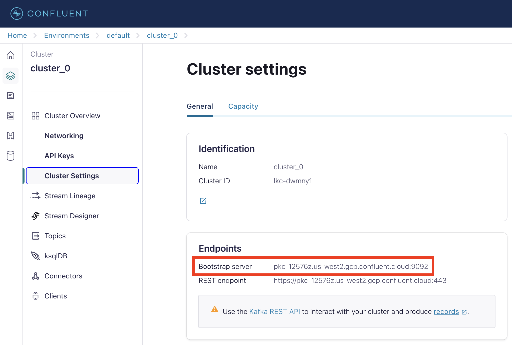

# Prompt 5

_This is great, it works flawlessly! Now, instead of sending the messages from the Node.js server to the Mirror HTML5 app, I want to publish these messages to my Confluent Cloud Kafka broker. How would I do that? This means, the Mirror app would not render anything._

To modify your setup so that the Node.js server publishes the drawing messages to your Confluent Cloud Kafka broker, follow these steps:
Set Up the Kafka Producer in Node.js
Modify the WebSocket Server to Publish Messages to Kafka

## 1. Set Up the Kafka Producer in Node.js
First, ensure you have the kafkajs library installed:

```
npm install kafkajs
```

## 2. Modify the WebSocket Server to Publish Messages to Kafka
Here is the updated websocket-server.js script:

```
const WebSocket = require('ws');
const { Kafka } = require('kafkajs');

// Confluent Cloud configuration
const kafka = new Kafka({
  clientId: 'websocket-server',
  brokers: ['your_bootstrap_servers'], // Replace with your Confluent Cloud bootstrap servers
  ssl: true,
  sasl: {
    mechanism: 'plain',
    username: 'your_api_key', // Replace with your Confluent Cloud API key
    password: 'your_api_secret', // Replace with your Confluent Cloud API secret
  },
});

const producer = kafka.producer();

// Initialize WebSocket server
const server = new WebSocket.Server({ port: 8080 });

const run = async () => {
  // Connect the Kafka producer
  await producer.connect();

  server.on('connection', ws => {
    console.log('New client connected');

    ws.on('message', async message => {
      console.log(`Received: ${message}`);

      // Publish the message to the Kafka topic
      try {
        await producer.send({
          topic: 'your_topic_name', // Replace with your topic name
          messages: [
            { value: message },
          ],
        });
        console.log('Message published to Kafka');
      } catch (err) {
        console.error('Error publishing message to Kafka', err);
      }
    });

    ws.on('close', () => {
      console.log('Client disconnected');
    });
  });

  console.log('WebSocket server is running on ws://localhost:8080');
};

run().catch(console.error);
```

## Explanation:
1. Kafka Producer Configuration:

    - Configures the Kafka producer to connect to Confluent Cloud using the provided bootstrap_servers, api_key, and api_secret.
    - The kafka.producer() instance is created and connected.

2. WebSocket Server:

    - Listens for connections and messages from WebSocket clients.
    - On receiving a message, it publishes the message to the specified Kafka topic.
    - Logs success or error messages based on the outcome of the Kafka publish operation.

## Summary:
This updated Node.js WebSocket server now publishes drawing messages to your Confluent Cloud Kafka broker. The Mirror HTML5 application will not render anything, as it no longer receives WebSocket messages from the server. Instead, all drawing events are published directly to Kafka.

## Next Steps:
1. Deploy and run the updated WebSocket server.
2. Ensure your Confluent Cloud Kafka topic is correctly configured to receive the messages.
3. Create Kafka consumers as needed to process or view the published drawing events.

If you need a Kafka consumer script in Node.js or another language to process these messages, let me know, and I can help with that as well.

